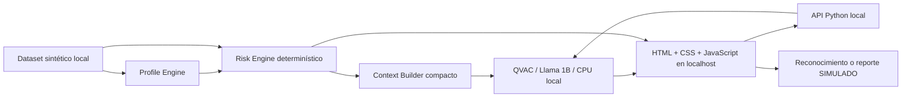

# BankGuard Local

«Tu información financiera no necesita salir del dispositivo para recibir inteligencia.»

Prototipo para Track 05 — Soluciones de AI Descentralizada para la Banca, Caja de Ahorros, Panamá. Asistente privado que explica anomalías en transacciones **100% sintéticas**. No determina fraude ni se conecta a sistemas bancarios.

## Why Local AI?

La conectividad no debería impedir revisar una operación sospechosa. El perfil y las transacciones permanecen en el dispositivo, el motor de riesgo funciona sin LLM y QVAC genera explicaciones en CPU local. No se requieren claves ni APIs de inferencia. La instalación inicial requiere dependencias y un modelo descargado previamente; las consultas usan exclusivamente el archivo GGUF existente.

## Architecture



El perfil se calcula únicamente sobre 24 operaciones de referencia anteriores a las 6 operaciones de evaluación. Nunca se incluye la operación evaluada en su propio perfil. La velocidad utiliza las operaciones anteriores de los últimos cinco minutos. Las anomalías no contaminan el perfil durante la demo.

Reglas demostrativas:

| Señal | Condición | Puntos |
|---|---|---:|
| Monto atípico | Mayor que máximo de 3×promedio y promedio+3×desviación poblacional | 30 |
| Hora inusual | Fuera del intervalo de horas observado, inclusivo | 15 |
| País inusual | No alcanza 10% del historial | 25 |
| Comercio nuevo | Ausente del historial de referencia | 15 |
| Alta velocidad | Dos operaciones anteriores dentro de cinco minutos | 15 |

0–29 bajo; 30–59 medio; 60–79 alto; 80–100 crítico. El score no es una probabilidad de fraude. El ejemplo TECH STORE obtiene **85**, no 87: 30+15+25+15. TX-1044 obtiene 100 por velocidad adicional. El promedio histórico es $28; el horario observado es 07:00–22:59, por agrupación en horas.

## QVAC

- Python 3.12.10; `tetherto-qvac-sdk==0.19.0`.
- Node.js 24.20.0; npm 11.19.0; `@qvac/sdk@0.19.0` global.
- `@qvac/embed-llamacpp@0.37.0` se utiliza para RAG local con GTE_LARGE_FP16 (669,603,712 bytes), desde disco.
- `LLAMA_3_2_1B_INST_Q4_0`, GGUF de 773,025,824 bytes ya disponible.
- API real: `Client(sdk_dir=...)`, `load_model(..., model_type='llamacpp-completion')`, `completion(...).text()`, `unload_model(...)`.
- Ruta local explícita, `seed=False`, CPU y cero capas GPU; nunca se pasa una URL de descarga al motor.
- Una inferencia a la vez por proceso. Se descarga de memoria el modelo y se cierra el worker en cada llamada. El RAG carga embeddings y LLM en workers separados y secuenciales. No hay P2P.
- Decodificación restringida con JSON Schema: el nivel, las razones y la acción solo pueden usar valores respaldados por el contexto. El resumen se selecciona entre frases seguras. **No es explicación libre**; esta restricción deliberada evita que un modelo pequeño invente motivos. La inferencia QVAC sí se ejecuta; no se presenta una plantilla de respaldo como IA.
- Si QVAC falla o devuelve razones incompletas, se muestra el error; el análisis determinístico permanece disponible. Timeout de 180 segundos para explicar transacciones y 300 para RAG. Un cierre de RPC durante RAG permite un único reintento con workers nuevos; no hay fallback cloud.

## Installation

En Windows, desde esta carpeta:

```powershell
python -m venv .venv
.\.venv\Scripts\python.exe -m pip install -r requirements.txt
npm install -g @qvac/sdk@0.19.0
$env:QVAC_SDK_DIR = Join-Path $env:APPDATA 'npm\node_modules\@qvac\sdk'
```

En esta computadora las dependencias y el modelo ya están instalados; no es necesario repetir la instalación global. En otra máquina, obtén el modelo oficial Llama 3.2 1B Instruct Q4_0 mediante el catálogo del SDK QVAC antes de desconectarte, respetando su licencia. El modelo no se distribuye en este repositorio. El programa no descarga modelos automáticamente.

La ruta predeterminada es `~/.qvac/models/f2bade0bc5cd4a8c_Llama-3.2-1B-Instruct-Q4_0.gguf`. Para otra ubicación:

```powershell
$env:BANKGUARD_MODEL = 'C:\ruta\Llama-3.2-1B-Instruct-Q4_0.gguf'
```

## Running

### Frontend principal (HTML + CSS + JavaScript)

```powershell
.\run-web.ps1
# o: python server.py
```

Abre http://127.0.0.1:8765. El servidor usa la biblioteca estándar de Python; no requiere FastAPI, npm, React ni un proceso de compilación. Los recursos del frontend, incluido el logo vectorial `logo.svg`, están en `frontend/` y se sirven localmente, sin fuentes, scripts ni estilos de CDN.

La API reconstruye el contexto y el score desde el dataset local, admite una inferencia a la vez y rechaza solicitudes de otros orígenes. Los botones de reconocimiento/reporte solo producen respuestas simuladas. La interfaz conserva resultados y decisiones en memoria de la pestaña: se limpian al recargar o pulsar Reiniciar demo. Cambiar de operación durante una inferencia no mezcla las respuestas.

### Tests y smoke test

```powershell
python -m unittest discover -s tests -v
```

Si usaste venv, reemplaza `python` por `.\.venv\Scripts\python.exe`. El análisis determinístico es inmediato; la explicación local puede tardar varios segundos en CPU. No abrir múltiples servidores QVAC simultáneamente.

Selecciona TX-1040 para el caso normal y TX-1042 para el crítico. Pulsa Analizar y luego Generar explicación QVAC local. No la reconozco crea el caso simulado FR-10482. Las decisiones viven solo en la sesión; Reiniciar simulación las borra. No se envían reportes ni se bloquean tarjetas reales.

## RAG documental local

En el frontend abre **Asistente documental** o desplázate a **Consulta tus documentos de seguridad**. Usa el ejemplo de phishing o pregunta por códigos OTP, compras desconocidas y bloqueos simulados.

Los cinco archivos Markdown de `data/security_docs/` contienen diez secciones. Todos declaran ser material 100% sintético y no políticas oficiales de Caja de Ahorros u otra entidad. Se pueden leer en el explorador de documentos del frontend.

Flujo: documentos → embeddings GTE mediante QVAC local → índice JSON → búsqueda híbrida (65% coseno, 35% coincidencia de términos) → tres fragmentos → Llama 1B selecciona fuente o se abstiene. La respuesta reproduce el fragmento íntegro seleccionado, con documento, sección y texto auditable. **RAG extractivo:** QVAC elige un identificador restringido por JSON Schema; la aplicación muestra el texto de esa fuente. No es una respuesta de redacción libre ni una garantía de relevancia. Se exige coincidencia de términos antes de permitir una cita: si ningún fragmento recuperado comparte términos relevantes, la única salida permitida es la abstención. Esta regla conservadora puede rechazar sinónimos o preguntas demasiado indirectas.

Primero se libera y se cierra el worker de embeddings; después se carga el LLM. Se comparte el bloqueo de inferencia con las explicaciones de transacciones dentro del proceso local.

El índice se guarda en `work/rag-index.json`, excluido de Git. Se reutiliza entre consultas y se reconstruye automáticamente si cambian los documentos o el archivo de embeddings. Cada pregunta genera su propio embedding; las respuestas no se cachean. No se guardan las preguntas del usuario en el índice.

Modelo predeterminado: `~/.qvac/models/8441c7419e66033f_gte-large_fp16.gguf`. Para otra ubicación define `BANKGUARD_EMBED_MODEL`. No se descargan modelos automáticamente. Para añadir documentos de prueba: crea un `.md` con título `#`, declaración sintética y secciones `##` de hasta 1800 caracteres; el MVP admite hasta 40 secciones. No uses datos bancarios reales.

La prueba física sin Internet sigue aplazada.

## Offline demonstration

1. Instala dependencias y confirma que el GGUF existe antes de desconectar.
2. Inicia el frontend local y genera una explicación.
3. Desactiva Wi-Fi y desconecta Ethernet/VPN con salida a Internet. Mantén la app en localhost abierta.
4. Selecciona **otra operación**, por ejemplo TX-1044, y pulsa Analizar y Generar explicación QVAC local. El botón siempre ejecuta inferencia nueva; no utiliza respuestas cacheadas.
5. Comprueba que aparecen nuevas razones, latencia y el score 100. Reinicia el servidor sin conexión y repite para demostrar arranque en frío.
6. Restaura la conexión al terminar.

**Estado de verificación:** inferencia real desde archivo local comprobada. La desconexión física total aún debe verificarse; no confundir usar un GGUF local con haber demostrado un equipo sin Internet. La sesión de trabajo no dispone de privilegios de administrador para aislar la red mediante firewall. Se incluye un guion para grabar esa prueba sin presentar resultados pregrabados como inferencia nueva.

## Synthetic Data

Todas las 30 transacciones son **100% sintéticas**, creadas para esta demostración. 24 forman un perfil panameño de promedio $28; 2 evaluaciones son normales y 4 contienen anomalías deliberadas. Los países, comercios, saldo, tarjeta y casos son ilustrativos. `authorized=true` representa el estado sintético de la operación; no implica que el usuario la haya reconocido. Fechas con offset UTC−05:00 de Panamá.

## Pre-existing work

Declaración explícita de bases consultadas y patrones reutilizados:

- Pruebas locales del participante: `qvac-prueba-script-static/main.py` y `qvac-prueba-chat/main.py`: patrón Client → load_model → completion → unload_model para Llama 1B.
- `qvac-prueba-rag/embed-test.py` y `rag-test.py`: consultados y reutilizados como referencia para inicialización de embeddings QVAC y búsqueda por similitud coseno; no se incorpora el documento Proyecto Atlas. El nuevo RAG utiliza documentos BankGuard, índice local y liberación secuencial de modelos.
- `qvac-project-phillips/runtime.py`: referencia para ruta GGUF local, `kv_cache=False`, configuración CPU y salida estructurada.
- `SAJA_HACKATHON/src/qvac_engine.py` y su reporte de smoke del 9 de septiembre: referencia para JSON Schema y limitaciones del event loop en Windows. Ese reporte corresponde a otro proyecto y **no prueba BankGuard**.
- QVAC SDK y su implementación instalada se inspeccionaron para verificar firmas y tipos reales. QVAC SDK declara licencia Apache-2.0; cada dependencia y modelo conserva su propia licencia.
- Dataset, motores de perfil/riesgo, interfaz, contexto, tests y documentación BankGuard fueron creados para este MVP con asistencia de OpenAI Codex. Codex se usó durante el desarrollo; no participa en la inferencia de la aplicación ni recibe transacciones en tiempo de ejecución.

Los proyectos anteriores no se modificaron. No se incluyen sus bases de datos, documentos ni credenciales.

## Limitations

Prototipo de hackathon, no sistema antifraude bancario de producción ni asesoría financiera. Las reglas no están calibradas con datos reales y pueden generar falsos positivos y negativos. Historial pequeño, referencia fija, solo USD y timestamps sintéticos coherentes; no incluye conversión horaria por comercio, aprendizaje, autenticación, cifrado de almacenamiento, persistencia de casos ni integraciones bancarias. No garantiza detección de fraude. El RAG es extractivo y limitado a documentos sintéticos; no está evaluado con un corpus bancario real. GTE y el modelo Llama pequeños pueden recuperar o seleccionar una sección poco específica. Las fuentes quedan visibles para verificar. No hay Pears.

## Verification results — 10 septiembre 2026

Frontend web verificado en navegador: TX-1042 → score 85 → explicación QVAC real en 14.73 s → reporte simulado FR-10482. TX-1040 → score 0 → reconocimiento simulado. Se comprobó que cambiar de operación mantiene separados sus resultados.

21 pruebas determinísticas, de dataset/contexto, RAG y API web pasaron, incluyendo fallo QVAC, exclusión de inferencias concurrentes y reinicio de la simulación. La prueba física sin Internet sigue pendiente.

## Identidad visual

Frontend con identidad propia azul y blanco, iconos SVG locales y emblema de bóveda/protección. El logo está en `frontend/logo.svg` y también funciona como favicon; fue creado para BankGuard con asistencia de Codex. No se descargan fuentes ni recursos gráficos externos.
